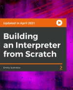
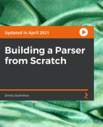
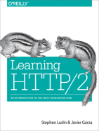
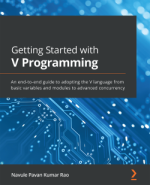

# CK.Books

Software engineering stuff I've read that you might be interested in.

**Note:** I’m not affiliated with any of the authors/publishers/etc. in anyway, and the perspective I shared is my own, not necessarily my [employer's](https://www.linkedin.com/in/collinkruger/).

## Building an Interpreter from Scratch

https://www.packtpub.com/product/building-an-interpreter-from-scratch-video/9781801071338

**What I built!** : [CK-Flavored-S-Expression-Interpreter](examples/BuildingAnInterpreterFromScratch/CK-Flavored-S-Expression-Interpreter.ipynb)

Keeping this review short and simple. [Building an Interpreter from Scratch](https://www.packtpub.com/product/building-an-interpreter-from-scratch-video/9781801071338) builds upon [Building a Parser from Scratch](#building-a-parser-from-scratch). The educational style of loosely explaining fundamental concepts, then jumping into narrating writing code holds over from the previous course.

To get into interpreting quickly the author uses a parser generator to generate a parser for an S-Expression like grammer. If you’re interested in learning about parser generators, the author has a course [Parsing Algorithms](https://www.packtpub.com/product/parsing-algorithms-video/9781801074445) which covers that and related topics (Note: I have not taken that course, so cannot vouch for it at this time).

The remainder of the course consisted of implementing progressively more complicated language constructs starting with global variables, then functions, up to classes and inheritance, and then modules.

I originally thought I could watch the 3-hour course straight through and understand the concepts; however, 2 hours in and I found myself not retaining information. I decided to take a crack at building my own language without directly following along. This process of struggle was great for understanding the underlying concepts of what the author was writing and describing during the course.

I would recommend this to someone who is interested in learning how to write their own language, or who wants to dig deeper into how programming languages are implemented. Though not required I would recommend being familiar with parsing. Specifically, the chapter list in [Parsing Algorithms](https://www.packtpub.com/product/parsing-algorithms-video/9781801074445) seems to have the information I feel that I was missing when going through this course.

_November 17, 2022_

## Building a Parser from Scratch

https://www.packtpub.com/product/building-a-parser-from-scratch-video/9781801075107

Over the years I’ve tried to learn how to write a compiler, but always ran out of time or motivation. The first phase of compiling is tokenizing and parsing syntax (code). A few weeks ago, I found myself needing to do this first phase. Parsing, if you don’t know what you’re doing, is painful, as anyone who has tried to implement a simple math expression evaluator without knowledge of parsing can attest.

I decided to one once more take up the challenge of learning tokenization and parsing. This time, I chose to be taught, and decided to go through [Building a Parser from Scratch](https://www.packtpub.com/product/building-a-parser-from-scratch-video/9781801075107).

The course consists of building a tokenizer/parser for a language that is kind of a merge of JavaScript and Python. It’s very pragmatic and approachable, but I am glad I have a little bit of experience in the space because some of the concepts were glossed over covered in a “Now I’m doing X” instead of “Because of Y, I am now doing X” way. It’s more follow along, and less being taught.

However, the author might have taken the right approach because I can now say I can write recursive descent parsers. Thanks to the class I’ve been able to move forward with work, and also pick back up a personal project that requires this skill.

If you’re interested in parsers, I threw together a parser for a subset of the Mermaid.JS language last night.

See it at [examples/BuildingAParserFromScratch/MinimalMermaidParser.ipynb](examples/BuildingAParserFromScratch/MinimalMermaidParser.ipynb).

By definition the parser takes a mermaid syntax and converts it into an abstract syntax tree (AST). Once in tree form this AST can be used by an interpreter, a compiler, a transpiler, etc. This process is useful for migrating old code, implementing expression evaluators for expressions defined by users at runtime, etc. If you’re interested in compilers, parsers, or would like to have a new tool in your toolbox, do check out this course.

_October 31, 2022_

## Learning HTTP/2

https://www.oreilly.com/library/view/learning-http2/9781491962435/

HTTP/2 is the now widely supported successor of HTTP/1.1. Built on top of the work done at Google for the SPDY protocol, HTTP/2 significantly alters the very simple request-response paradigm of HTTP/1.1, including adding server push, multiplexing over a single TCP connection, and alterations to how headers work including compression. 

Learning HTTP/2 can be defined as a book in three acts. How did we get here and what were the problems and solutions along the way? How does HTTP/2 address those problems, what are its pros and cons, and what tools and techniques are available for working with it and debugging? And where do we see the future going? 

At important points, the authors took a numbers driven approach to comparing HTTP/1.1 to HTTP/2, demonstrating that certain metrics like Time To First Byte don’t mean the same thing between the protocols, and that in certain scenarios HTTP/2 performs worse than HTTP/1.1. As an engineer and also just core to who I am, I really appreciate these honest observations. 

At just 156 pages, the authors largely adhered to the writing philosophy “never use two words when one will do”. Pairing their concise yet conversational style with a “building from the bottom up” structuring of knowledge makes the book effective at getting information into the reader’s brain. 

One critique would be that, for me, some of the chapters are a tad long. For a variety of reasons sitting down for an extended period to read and focus can be difficult. However, doing just that is important, as my brain prefers consuming a rounded out and complete concept in its entirety which it can later process in the background. Fortunately, only two chapters were on the longer side. 

I like this book a lot and would definitely recommend it to someone who is looking to become familiar and effective with HTTP/2, or really anyone who works in the web space. It offers knowledge, tools, and techniques that are useful for front-end, back-end, and network engineers. 

_October 24, 2022_

## Getting Started with V Programming

https://www.packtpub.com/product/getting-started-with-v-programming/9781839213434

[V is a language](https://vlang.io/) I’ve dabbled in on and off since I bumped into it in a [LogRocket blog post](https://blog.logrocket.com/what-is-vlang-an-introduction/). It has interesting characteristics similar to [Rust](https://www.rust-lang.org/) in that it is a low-level language that by default enables you to **ignore** memory management without a garbage collector. It has high level functional features like immutability by default, sum types, option and result types, and no null (allowed in unsafe code). And lastly, it is obscenely fast at [compilation](https://fast.vlang.io/) and [execution](https://www.techempower.com/benchmarks/#section=data-r21&test=plaintext).

In this book, the author covers getting up and running with local build tools, covers the basics of the language and some of its more interesting characteristics, then dives into practical applications such as making HTTP requests, building a web service, and interacting with a database.

Though I did largely enjoy this book, I would squarely classify this as a gentle introduction. In any given chapter a concept is stated, and later restated in a different way. For topics I am new to I do find this manner of educating to be useful, but given I had already worked with the language, the book wasn’t quite dense enough for me.

As a critique, the book could use another round of proofing and technical review. There were some statements that were objectively wrong or lacked supporting evidence/references.

All in all, I did enjoy this book and was able to use a screen reader to listen to it rather quickly. It was a very easy read/listen and would be valuable for someone wanting an easy introduction to the language. If, however, you have experience with an existing language similar to [Go](https://go.dev/) or [Rust](https://www.rust-lang.org/), and/or prefer higher signal to noise ratio learning, the official [V lang docs](https://github.com/vlang/v/blob/master/doc/docs.md) are what you want.

_September 9, 2022_